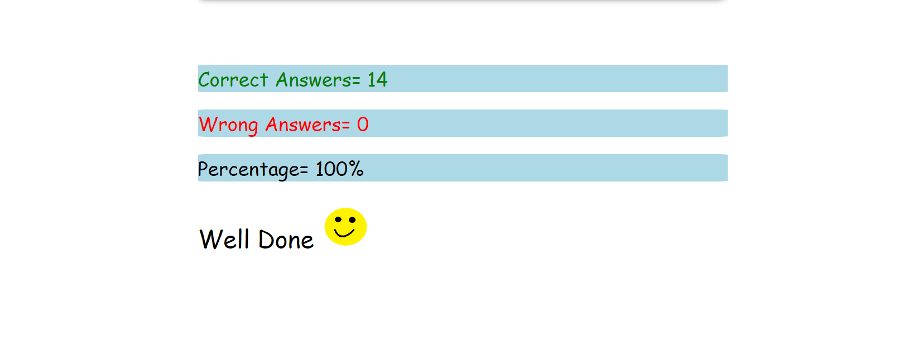

# Q1. Who is the founder of JavaScript and when?

Ans: Brendan Eich in 1995.

# Q2. What was the first browser, and when was it released?

Ans: WorldWideWeb in 1990.

# Q3. Name the two dominant browsers in 2000

Ans: NetScape Navigator and Internet Explorer.

# Q4. What is ECMAScript?

Ans: European Computer Manufacturers Assiociation is a scripting language specification on which JavaScriptis based. ECMA Internationalis in charge of standardizing ECMAScript.

# Q5. Define Syntax

Ans: Syntax is a set of rules that has to be followed while writing code.

# Q6. What is TC39?

Ans: Ecma International's TC39 is a group of JavaScript developers, implementers, academics, and more, collaborators with the community to maintain and evolve the definition of JavaScript.

# Q7. Name different data types in JavaScript

- String
- Number
- Bigint
- Boolean
- Undefined
- Null
- Symbol
- Object

# Q8. Explain primitive and non-primitive data types

Ans: Primitive data types are simple and predefined types like integers, and booleans, used for basic data storage, whereas non-primitive structures like arrays and lists are more complex, designed for organizing collections ofdata and enabling advanced data manipulation.

# Q9. Differentiate null and undefined

Ans: In JavaScript, null and undefined are two distinct types that represent different values. By definition, undefined means a variable has been declared but has not yet been assigned a value, whereas null is an assignment value, meaning that a variable has been declared and given the value of null.

## Q10.

